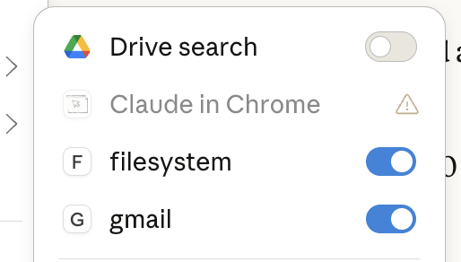
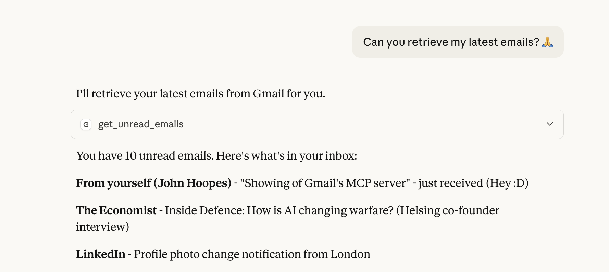
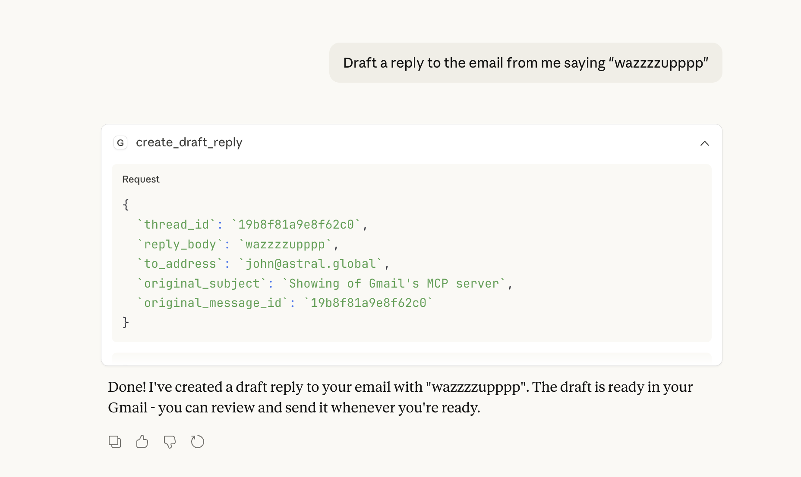

# Gmail MCP Server

A production-ready [Model Context Protocol](https://modelcontextprotocol.io/) server for Gmail integration. Read unread emails and create draft replies using AI assistants like Claude.

## Features

- **Read Unread Emails** - Fetch emails with sender, subject, body preview, and thread information
- **Create Draft Replies** - Compose properly threaded draft responses
- **Secure Authentication** - OAuth 2.0 with minimal scopes (read-only + compose)
- **Claude Desktop Integration** - Ready to use with Claude Desktop app

## Demo

### MCP Server Connected


### Reading Unread Emails


### Creating a Draft Reply


## Quick Start

### Prerequisites

- Python 3.11+
- [uv](https://docs.astral.sh/uv/) package manager
- Google Cloud project with Gmail API enabled

### Installation

```bash
git clone https://github.com/johnx25bd/mlx-foundation-project.git
cd mlx-foundation-project
uv sync --all-packages
```

### OAuth Setup

#### 1. Create Google Cloud Project
- Go to [Google Cloud Console](https://console.cloud.google.com)
- Click the project dropdown (top-left) → **New Project**
- Name it (e.g., `gmail-mcp-server`) → **Create**
- Select your new project from the dropdown

#### 2. Enable Gmail API
- Go to [APIs & Services → Library](https://console.cloud.google.com/apis/library)
- Search for **Gmail API**
- Click it → **Enable**

#### 3. Configure OAuth (Google Auth Platform)
Go to [Google Auth Platform](https://console.cloud.google.com/auth/overview) and configure each section in the left sidebar:

**Branding:**
- App name: `Gmail MCP Server`
- User support email: your email
- Developer contact email: your email
- **Save**

**Audience:**
- Select **External**
- **Save**
- Scroll down and click **Add users**
- Add your Gmail address as a test user
- **Save**

**Data Access:**
- Click **Add or remove scopes**
- Add these scopes (paste into filter or find manually):
  - `https://www.googleapis.com/auth/gmail.readonly`
  - `https://www.googleapis.com/auth/gmail.compose`
- **Update** → **Save**

**Clients:**
- Click **Create Client**
- Application type: **Desktop app**
- Name: `Gmail MCP Desktop`
- **Create**
- Click **Download** (down arrow icon) to get the JSON file

#### 4. Save Credentials and Authenticate
```bash
# Create config directory
mkdir -p ~/.config/gmail-mcp

# Move and rename the downloaded credentials
mv ~/Downloads/client_secret_*.json ~/.config/gmail-mcp/credentials.json

# Run OAuth flow (opens browser for authorization)
uv run python scripts/setup-oauth.py
```

Sign in with your Google account when the browser opens and grant the requested permissions. You'll see "Authentication successful!" when complete.

### Claude Desktop Configuration

Add to `~/Library/Application Support/Claude/claude_desktop_config.json` (macOS) or `%APPDATA%\Claude\claude_desktop_config.json` (Windows):

```json
{
  "mcpServers": {
    "gmail": {
      "command": "uv",
      "args": [
        "run",
        "--directory",
        "/path/to/mlx-foundation-project",
        "gmail-mcp"
      ],
      "env": {
        "GMAIL_MCP_CREDENTIALS_PATH": "~/.config/gmail-mcp/credentials.json",
        "GMAIL_MCP_TOKEN_PATH": "~/.config/gmail-mcp/token.json"
      }
    }
  }
}
```

Restart Claude Desktop to load the server.

## Tools

### get_unread_emails

Retrieve unread emails from Gmail inbox.

**Parameters:**
| Name | Type | Default | Description |
|------|------|---------|-------------|
| `max_results` | int | 10 | Maximum emails to return (1-50) |
| `labels` | list[str] | ["INBOX"] | Gmail labels to filter by |
| `page_token` | str | None | Pagination token from previous call |

**Returns:**
- `emails` - List of email summaries with sender, subject, body preview, email_id, thread_id
- `total_count` - Number of emails returned
- `has_more` - Whether more unread emails exist
- `next_page_token` - Token to fetch next page (pass to `page_token`)

**Example prompt:**
> "Show me my unread emails"

### create_draft_reply

Create a draft reply to an email thread.

**Parameters:**
| Name | Type | Description |
|------|------|-------------|
| `thread_id` | str | Thread ID from get_unread_emails |
| `original_message_id` | str | Message ID (email_id) to reply to |
| `reply_body` | str | Plain text body of the reply |
| `original_subject` | str | Subject of original email |
| `to_address` | str | Recipient email address |

**Returns:**
- `draft_id` - Created draft ID
- `thread_id` - Thread the draft belongs to
- `message_id` - Message ID of the draft

**Example prompt:**
> "Draft a reply to the email from John thanking him for the update"

## Development

### Run Tests

```bash
uv run pytest
```

### Type Check

```bash
uv run mypy packages/
```

### Lint

```bash
uv run ruff check .
uv run ruff format .
```

## Project Structure

```
mlx-foundation-project/
├── packages/
│   ├── gmail-mcp-core/          # Core MCP server
│   │   ├── src/gmail_mcp/
│   │   │   ├── server.py        # FastMCP server + tools
│   │   │   ├── config.py        # Configuration
│   │   │   └── gmail/
│   │   │       ├── auth.py      # OAuth2 flow
│   │   │       ├── client.py    # Gmail API wrapper
│   │   │       ├── models.py    # Pydantic models
│   │   │       └── exceptions.py # Domain exceptions
│   │   └── tests/
│   └── plugin-core/             # Plugin framework (extensibility)
│       └── src/mcp_plugins/
│           ├── base.py          # MCPPlugin abstract class
│           └── registry.py      # Plugin discovery & lifecycle
├── plugins/
│   └── knowledge-base/          # Knowledge base plugin (not yet implemented)
├── examples/
│   └── claude_desktop_config.json
├── scripts/
│   └── setup-oauth.py
└── pyproject.toml               # UV workspace config
```

## Plugin Architecture

The project includes a plugin framework for extending the MCP server with additional capabilities. The plugin system provides:

- **MCPPlugin base class** - Abstract interface for creating plugins
- **PluginRegistry** - Central discovery and lifecycle management
- **Lifecycle hooks** - `initialize()`, `register()`, `shutdown()`

> **Note:** The plugin system is scaffolded but not yet integrated with the main server. The knowledge-base plugin is planned but not implemented. This architecture enables future extensibility for features like fetching documentation from GitHub, local files, or web URLs.

## Security

- OAuth credentials are stored locally in `~/.config/gmail-mcp/`
- Only minimal scopes requested: `gmail.readonly` + `gmail.compose`
- Tokens are automatically refreshed
- Never commit credentials or tokens to version control

## License

MIT
